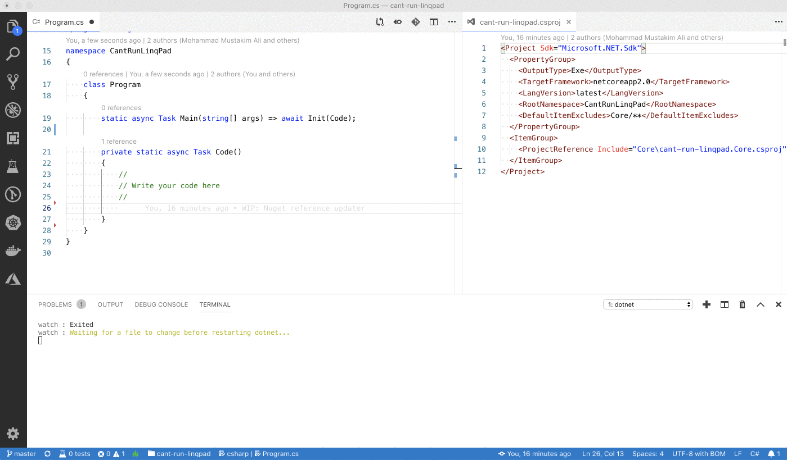

# Can't Run LinqPad

When you can't run LinqPad

```
curl -sSL https://raw.githubusercontent.com/mustakimali/cant-run-linqpad/master/Core/first-start.sh | bash
```

## How to use

### Dump
Use the extension method `Dump([title], [indent])` to output anything.

### Reference NuGet Package

Paste a Nuget Cli command in a commented out c# code. One command per line

Both Package Manager and .NET CLI syntax are supported.

```
// Install-Package Newtonsoft.Json -Version 12.0.1
// dotnet add package Newtonsoft.Json --version 12.0.1
```

